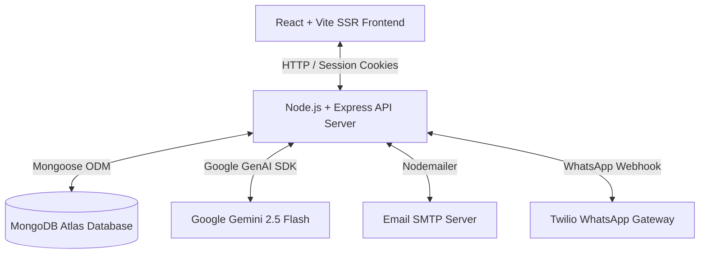
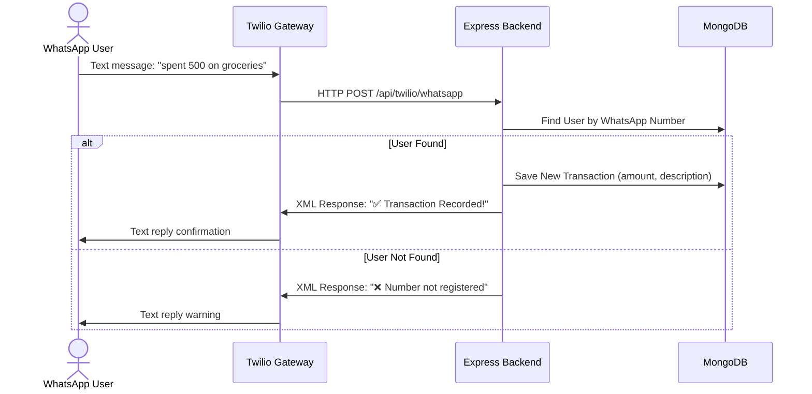

  

---

  
  
  
  
  
  

---

FinanceFlow is an AI-powered financial management platform designed to help individuals and small businesses effortlessly track, analyze, and optimize their spending with real-time insights.

---

## 🌟 Key Features

* **Advanced Analytics:** Detailed charts and trends representing spending patterns, category distributions, and relative income-to-expense variances.
* **Smart Receipt Scanner:** Drag-and-drop OCR tool powered by **Google Gemini 2.5 Flash** to automatically scan, parse, and upload transaction line items.
* **Intelligent Chatbot:** Direct, conversational assistant to query balances, fetch summaries, and request personal budgeting advice.
* **WhatsApp Expense Tracking (Twilio):** Record transactions directly by texting a Twilio WhatsApp sandbox number (e.g., "spent 500 on groceries").
* **Automated Monthly Alerts:** Automated background scheduler that creates, formats, and emails personalized monthly financial roundups.

---

## 🏗️ System Architecture

The application is structured into three primary layers to maximize performance and data integrity:

### 1. Presentation Layer (Vite + React SPA / SSR)
- Single Page Application with server-side hydration capability.
- Communicates with the backend API via cookies and session-based fetch requests.
- Client-side views render components (Dashboard, Analytics charts, Forms) dynamically based on current auth state.

### 2. Service & Orchestration Layer (Node.js + Express)
- Handles core routing, session management, and authentication guards.
- **Generative AI Handler:** Communicates with Google Gemini API for OCR receipt parsing, conversational chatbot logic, and monthly analytics.
- **WhatsApp Webhook:** Processes messages sent via Twilio's WhatsApp sandbox API.
- **Job Scheduler:** Executes recurring processes (e.g., daily transaction resets, monthly summary alerts) mapped to secure Vercel Cron endpoints.

### 3. Data Storage Layer (MongoDB Atlas)
- **User Document Schema:** Stores user credentials, WhatsApp phone numbers, and references to associated bank accounts.
- **Account Schema:** Tracks distinct financial wallets (Savings, Current) and their balances.
- **Transaction Schema:** Logs historical income/expense records with Decimal128 precision.

---

## 📊 Transaction Flows

### WhatsApp Expense Logging Sequence

---

## 🤝 FinanceFlow Development Team

* [Pranjal Singh](https://github.com/prancodes)
* [Om Singh](https://github.com/24-droid)
* [Pushkar Singh](https://github.com/BackpropX)
* [Vikas Vishwakarma](https://github.com/VikasVk03)

---

© 2026 FinanceFlow. All rights reserved.
